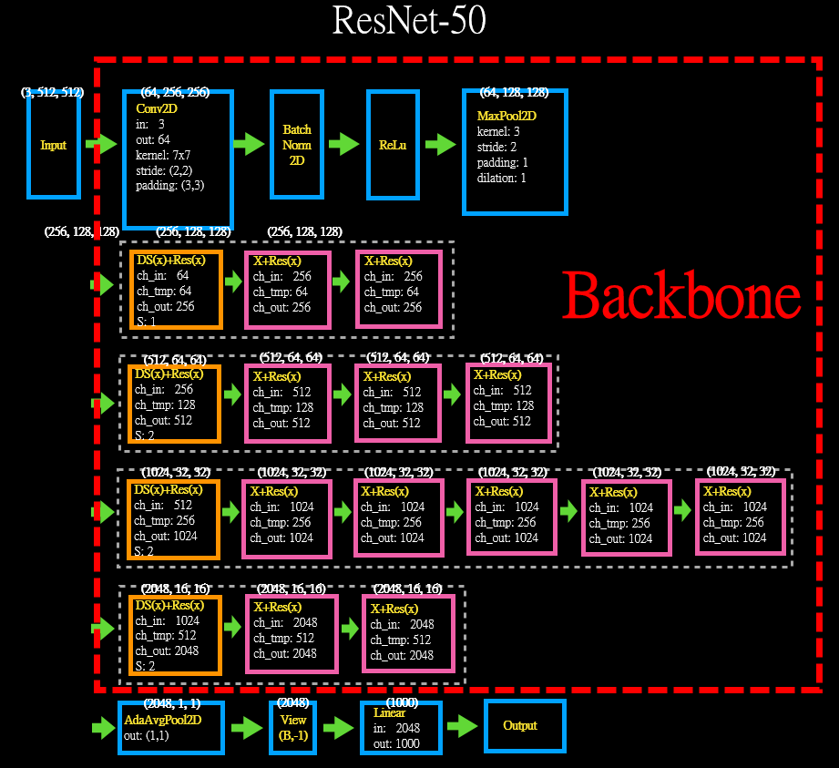
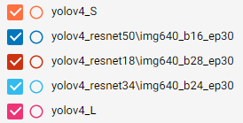
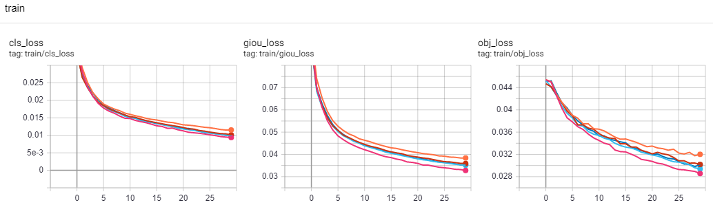

# Yolov4 with Resnet18/34/50 Backbones
## 目的:
##### 這邊嘗試著以 Resnet 將 Yolov4 的 backbone 做替換來看看會有怎樣的訓練趨勢。
***
## Backbone 替換
Yolov4:  


***
## yaml 檔修改
##### 原始的 Yolov4_L yaml 檔案的 backbone

##### 修改後的 Yolov4_L_resnet18 yaml  

##### 修改後的 Yolov4_L_resnet34 yaml  

##### 修改後的 Yolov4_L_resnet50 yaml  

***
## 程式修改
### yolo.py, parse_model() 增加
```
resnet_n=n
elif m is resLayer:
    c1=ch[f if f<0 else f+1]
    c2=args[0]
    args=[c1,c2,resnet_n,*args[1:]]

if m is resLayer:
    m_=m(*args)
    c2*=4 #blocks.expansion
```
### common.py 增加
```
def conv3x3(in_planes, out_planes, stride=1, groups=1, dilation=1):
    return nn.Conv2d(in_planes, out_planes, kernel_size=3, stride=stride,padding=dilation, groups=groups, bias=False, dilation=dilation)

def conv1x1(in_planes, out_planes, stride=1):
    return nn.Conv2d(in_planes, out_planes, kernel_size=1, stride=stride, bias=False)

class resBottleneck(nn.Module):
    expansion = 4
    def __init__(self, inplanes, planes, stride=1, groups=1, base_width=64, dilation=1, norm_layer=None, downsample=False):
        super(resBottleneck, self).__init__()
        if norm_layer is None:
            norm_layer = nn.BatchNorm2d
        width = int(planes * (base_width / 64.)) * groups
        # Both self.conv2 and self.downsample layers downsample the input when stride != 1
        self.conv1 = conv1x1(inplanes, width)
        self.bn1 = norm_layer(width)
        self.conv2 = conv3x3(width, width, stride, groups, dilation)
        self.bn2 = norm_layer(width)
        self.conv3 = conv1x1(width, planes * self.expansion)
        self.bn3 = norm_layer(planes * self.expansion)
        self.relu = nn.ReLU(inplace=True)
        if downsample:
            self.downsample = nn.Sequential(conv1x1(inplanes, planes * self.expansion, stride),nn.BatchNorm2d(planes * self.expansion),)
        else:
            self.downsample=None
        self.stride = stride

    def forward(self, x):
        identity = x
        out = self.relu(self.bn1(self.conv1(x)))
        out = self.relu(self.bn2(self.conv2(out)))
        out = self.bn3(self.conv3(out))

        if self.downsample is not None:
            identity = self.downsample(x)

        out += identity
        out = self.relu(out)

        return out

class resLayer(nn.Module):
    def __init__(self, c1, c2, n=1, s=1, g=1, w=64, downsample=False): #chin, plane, block_nums, group, width_per_group
        super(resLayer,self).__init__()
        blocks=[resBottleneck(inplanes=c1, planes=c2, stride=s, groups=g, base_width=w, downsample=downsample)]
        for _ in range(n-1):
            blocks.append(resBottleneck(inplanes=c2*resBottleneck.expansion, planes=c2, stride=1, groups=g, base_width=w))
        self.layers = nn.Sequential(*blocks)
    def forward(self, x):
        return self.layers(x)
```
***
## parameter 變化量
### 原始的 Yolov4_S
```
                 from  n    params  module                                  arguments
  0                -1  1       464  models.common.Conv                      [3, 16, 3, 1]
  1                -1  1      4672  models.common.Conv                      [16, 32, 3, 2]
  2                -1  1      5216  models.common.Bottleneck                [32, 32]
  3                -1  1     18560  models.common.Conv                      [32, 64, 3, 2]
  4                -1  1     19904  models.common.BottleneckCSP             [64, 64, 1]
  5                -1  1     73984  models.common.Conv                      [64, 128, 3, 2]
  6                -1  1    161152  models.common.BottleneckCSP             [128, 128, 3]
  7                -1  1    295424  models.common.Conv                      [128, 256, 3, 2]
  8                -1  1    641792  models.common.BottleneckCSP             [256, 256, 3]
  9                -1  1   1180672  models.common.Conv                      [256, 512, 3, 2]
 10                -1  1   1248768  models.common.BottleneckCSP             [512, 512, 1]
 11                -1  1   1904640  models.common.SPPCSP                    [512, 256, 1]
 
 Model Summary: 226 layers, 9.12461e+06 parameters, 9.12461e+06 gradients
```
### 原始的 Yolov4_L
```
                 from  n    params  module                                  arguments
  0                -1  1       928  models.common.Conv                      [3, 32, 3, 1]
  1                -1  1     18560  models.common.Conv                      [32, 64, 3, 2]
  2                -1  1     20672  models.common.Bottleneck                [64, 64]
  3                -1  1     73984  models.common.Conv                      [64, 128, 3, 2]
  4                -1  1    119936  models.common.BottleneckCSP             [128, 128, 2]
  5                -1  1    295424  models.common.Conv                      [128, 256, 3, 2]
  6                -1  1   1463552  models.common.BottleneckCSP             [256, 256, 8]
  7                -1  1   1180672  models.common.Conv                      [256, 512, 3, 2]
  8                -1  1   5843456  models.common.BottleneckCSP             [512, 512, 8]
  9                -1  1   4720640  models.common.Conv                      [512, 1024, 3, 2]
 10                -1  1  12858368  models.common.BottleneckCSP             [1024, 1024, 4]
 11                -1  1   7610368  models.common.SPPCSP                    [1024, 512, 1]
Model Summary: 334 layers, 5.25155e+07 parameters, 5.25155e+07 gradients
```
### 修改後的 Yolov4_resnet18
```
                 from  n    params  module                                  arguments
  0                -1  1      9408  torch.nn.modules.conv.Conv2d            [3, 64, 7, 2, 3, 1, 1, False]
  1                -1  1       128  torch.nn.modules.batchnorm.BatchNorm2d  [64]
  2                -1  1         0  torch.nn.modules.activation.ReLU        [True]
  3                -1  1         0  torch.nn.modules.pooling.MaxPool2d      [3, 2, 1]
  4                -1  2    147968  models.common.resBasicLayer             [64, 64, 2, 1, 1, 64, False]
  5                -1  2    525568  models.common.resBasicLayer             [64, 128, 2, 2, 1, 64, True]
  6                -1  2   2099712  models.common.resBasicLayer             [128, 256, 2, 2, 1, 64, True]
  7                -1  2   8393728  models.common.resBasicLayer             [256, 512, 2, 2, 1, 64, True]
  8                -1  1   7086080  models.common.SPPCSP                    [512, 512, 1]
  
Model Summary: 198 layers, 3.64896e+07 parameters, 3.64896e+07 gradients
```
### 修改後的 Yolov4_resnet34
```
                 from  n    params  module                                  arguments
  0                -1  1      9408  torch.nn.modules.conv.Conv2d            [3, 64, 7, 2, 3, 1, 1, False]
  1                -1  1       128  torch.nn.modules.batchnorm.BatchNorm2d  [64]
  2                -1  1         0  torch.nn.modules.activation.ReLU        [True]
  3                -1  1         0  torch.nn.modules.pooling.MaxPool2d      [3, 2, 1]
  4                -1  3    221952  models.common.resBasicLayer             [64, 64, 3, 1, 1, 64, False]
  5                -1  4   1116416  models.common.resBasicLayer             [64, 128, 4, 2, 1, 64, True]
  6                -1  6   6822400  models.common.resBasicLayer             [128, 256, 6, 2, 1, 64, True]
  7                -1  3  13114368  models.common.resBasicLayer             [256, 512, 3, 2, 1, 64, True]
  8                -1  1   7086080  models.common.SPPCSP                    [512, 512, 1]

Model Summary: 246 layers, 4.65978e+07 parameters, 4.65978e+07 gradients
```
### 修改後的 Yolov4_resnet50
```
                 from  n    params  module                                  arguments
  0                -1  1      9408  torch.nn.modules.conv.Conv2d            [3, 64, 7, 2, 3, 1, 1, False]
  1                -1  1       128  torch.nn.modules.batchnorm.BatchNorm2d  [64]
  2                -1  1         0  torch.nn.modules.activation.ReLU        [True]
  3                -1  1         0  torch.nn.modules.pooling.MaxPool2d      [3, 2, 1]
  4                -1  3    215808  models.common.resLayer                  [64, 64, 3, 1, 1, 64, True]
  5                -1  4   1219584  models.common.resLayer                  [256, 128, 4, 2, 1, 64, True]
  6                -1  6   7098368  models.common.resLayer                  [512, 256, 6, 2, 1, 64, True]
  7                -1  3  14964736  models.common.resLayer                  [1024, 512, 3, 2, 1, 64, True]
  8                -1  1   8658944  models.common.SPPCSP                    [2048, 512, 1]
  
Model Summary: 297 layers, 5.06398e+07 parameters, 5.06398e+07 gradients
```
***
## 測試結果
##### 因為coco 圖片集太多，為實驗方便，此處依舊僅取其車輛部分 names: ['motorcycle','car','bus','truck'], 測試結果如下:





***
## 參考
[Yolov4](https://github.com/WongKinYiu/PyTorch_YOLOv4)  
[Pytorch Resnet](https://pytorch.org/docs/stable/_modules/torchvision/models/resnet.html#resnet50)
